# ChaosMachineOne for PHP
A controlled random generator data for PHP. The objective is to generate and fill random values
 to Mysql (and Sql server) with some trend, so the values are not as random for to be usable.


[](https://travis-ci.org/EFTEC/ChaosMachineOne)
[](https://packagist.org/packages/eftec/chaosmachineone)
[](https://packagist.org/packages/eftec/chaosmachineone)
[]()
[]()
[]()
[]()
[]()


- [ChaosMachineOne for PHP](#chaosmachineone-for-php)
  * [What is the objective?](#what-is-the-objective-)
  * [fields](#fields)
  * [gen](#gen)
    + [minilang](#minilang)
    + [Logic](#logic)
  * [Range Functions (numbers)](#range-functions--numbers-)
    + [ramp($fromX, $toX, $fromY, $toY)](#ramp--fromx---tox---fromy---toy-)
    + [log($startX,$startY,$scale=1)](#log--startx--starty--scale-1-)
    + [exp($startX,$startY,$scale=1)](#exp--startx--starty--scale-1-)
    + [sin($startX,$startY,$speed=1,$scale=1)](#sin--startx--starty--speed-1--scale-1-)
    + [atan($centerX,$startY,$speed=1,$scale=1)](#atan--centerx--starty--speed-1--scale-1-)
    + [parabola($centerX,$startY,$scaleA=1,$scaleB=1,$scale=1)](#parabola--centerx--starty--scalea-1--scaleb-1--scale-1-)
    + [bell($centerX, $startY, $sigma=1, $scaleY=1)](#bell--centerx---starty---sigma-1---scaley-1-)
  * [Fixed functions (numbers)](#fixed-functions--numbers-)
    + [randomprop(...$args)](#randomprop--args-)
    + [random($from,$to,$jump=1,$prob0=null,$prob1=null,$prob2=null)](#random--from--to--jump-1--prob0-null--prob1-null--prob2-null-)
    + [field.speed=xxxx](#fieldspeed-xxxx)
    + [field.accel=xxxx](#fieldaccel-xxxx)
    + [field.value=xxxx](#fieldvalue-xxxx)
    + [field.getvalue](#fieldgetvalue)
    + [field.valueabs](#fieldvalueabs)
    + [field.day , field.month , field.year, field.hour, field.minute, field.weekday](#fieldday---fieldmonth---fieldyear--fieldhour--fieldminute--fieldweekday)
    + [field.stop=xxxx](#fieldstop-xxxx)
    + [field.add=xxxx](#fieldadd-xxxx)
    + [field.skip=xxx](#fieldskip-xxx)
  * [Arrays and texts](#arrays-and-texts)
    + [->setArray('arrayname',[])](#--setarray--arrayname-----)
    + [->setFormat('formatName',[])](#--setformat--formatname-----)
    + [randomarray("arrayname",'field'=null)](#randomarray--arrayname---field--null-)
    + [randomtext($starting,$arrayName,$paragraph,$wordMinimum,$wordMaximum)](#randomtext--starting--arrayname--paragraph--wordminimum--wordmaximum-)
    + [randomformat($nameFormat)](#randomformat--nameformat-)
  * [version](#version)


## What is the objective?

Sometimes we want to generate fake values for the database that are controlled and 
consistent. So, this library tries to create an ordered chaos. 

While there are libraries to generate random values (such as fzaninotto/Faker), the objective of this library is to fill tables with random but credible/with a trend value.


[Medium Article](https://medium.com/cook-php/chaos-and-control-or-the-art-of-randomness-40e04662a81e)

Let's say the next exercise.  We want to generate random values for a new system (sales)

If we generate random values, the chart would look like

> ->gen('when _index<200 then idtable.value=random(-10,10,0.2)')

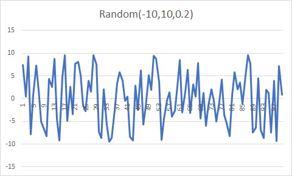


Why is it so random? it is because they are random values (doh).  So,
they are right but they don't looks real because there is not a trend or a natural flow of information, it is just static noise.

Then, let's generate the same value with a sine (for example, let's say that there is a cycle of sales)

> ->gen('when _index<200 then idtable.add=sin(0,0,10,30)')


The chart has a trend but it is too predictable.  So, let's add all factors.


> ->gen('when _index<200 then idtable.value=random(-10,10,0.2) and idtable.add=sin(0,0,10,30)')

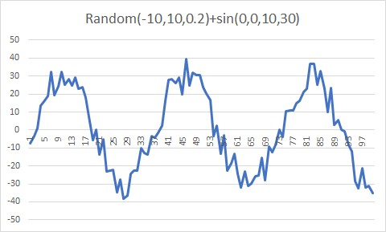

While this chart is far from real, but it is not TOO RANDOM and it has a trend. 

## fields

> field($name,$type,$special='database',$initValue=0,$min=PHP_INT_MIN,$max=PHP_INT_MAX)

fields are our values. They could be numeric, date and string.  

* Fields could have speed and acceleration. However, if you change the value manually, then the speed and acceleration is ignored.  

* "field.value=X"  it sets the value of the field.
* "field.speed=X"  it sets the speed of the field.
* "field.accel=X"  it sets the acceleraiton of the field. If the speed is set manually, then the acceleration is ignored.
* "field.stop=X" it sets the speed and acceleration to zero, and sets the value to X.

* The speed and acceleration is evaluated when it is executed (method run() )


Examples:   
> "set field.value=20" // it sets the value of the field to 20   
> "set field.speed=3" // it sets the speed of the field by 3. The field increases the value every cycle by 3    
> "set field.accel=1" // it sets the acceleration of the field by 1. The field increases the speed every cycle by 1    
> "set field.value=30 and field.speed=1" // the value is always 30, no matter the speed    

```
->gen('when _index<40 then idtable.accel=1') // the acceleration is 1 until index=40
->gen('when _index<60 then idtable.accel=-1') // the acceleration is -1 until index=60
->gen('when _index<100 then idtable.accel=-1') // the acceleration is -1 until index=100
```
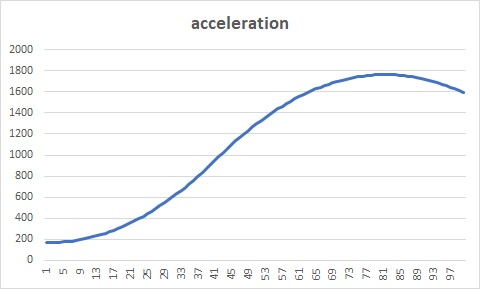

## gen

It generates a value using the Minilang syntaxis.

The syntaxis is as follow:  

```
when logic and/or logic2 and/or logic3 then setvalue1 , setvalue2 , setvalue3
```

### minilang

| Variable                                           | Explanation                                         | Example                              |
|----------------------------------------------------|-----------------------------------------------------|--------------------------------------|
| $var                                               | it is php global variable.                          | $var="hi"                            |
| field                                              | it is an minilang variable.                         | field                                |
| field.value   it is the value of a column (if any) | field.value="hi"                                    |                                      |
| _index                                             | indicates the current index (current number of row) | _index<200                           |
| 20 , 20.50                                         | its a fixed value                                   | 20,50.3                              |
| "text",'text'                                      | it is fixed string value                            | "text",'text'                        |
| fn()                                               | its a function                                      | myfunction(value), some.myfunction() |

### Reserved variables

| Reserved word | Explanation                                                                  |
|---------------|------------------------------------------------------------------------------|
| null          | null value                                                                   |
| false         | false value                                                                  |
| true          | true value                                                                   |
| on            | 1                                                                            |
| off           | 0                                                                            |
| undef         | -1 (for undefined)                                                           |
| flip          | (special value). It inverts a value ON<->OFF<br>Used as value.flip                                 |
| now           | returns the current timestamp (integer)                                      |
| timer         | returns the current timestamp (integer)                                      |
| interval      | returns the interval (in seconds) between the last change and now            |
| fullinterval  | returns the interval (in seconds) between the start of the process and   now |
| _index  | returns the current index (the current counter of row) |
| always  | reserved word. It is used as "when always" |

Examples:

myvar = is a variable

> when always set myvar.value=null   
> when _index<20 set myvar.value=false

Limits.
* Parenthesis are now allowed (unless it is defines a function).
* * > a1=(20+30) is not allowed however a1=20 , a1+30 is allowed
* The syntax is divided in two parts, one of the logic (when) and other is the set (then)
* Conditions are evaluated in order. If one condition is meet, then it stop other evaluations.
* * > when a1=1 then b1=1
* * > when a1<10 then b1=10 // if a1=1 then this expression is not evaluated.


### Logic

It sets the condition(s) separated by **and** or **or**

> It is not allowed to use more than operator for logic.  a1=20+30 is not allowed.  


## Range Functions (numbers)

Functions that generates a range of values


### ramp($fromX, $toX, $fromY, $toY)

It generates a ramp values (lineal values)
```
->gen('when _index<200 then idtable.value=ramp(0,100,10,1000)')
```

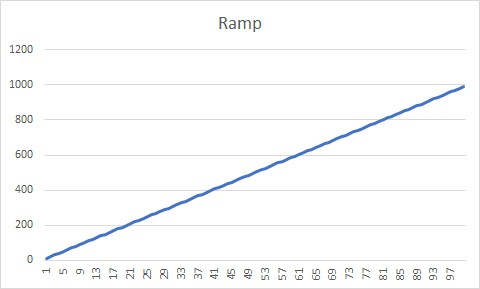

```
->gen('when _index<200 then idtable.value=ramp(0,100,1000,10)')
```

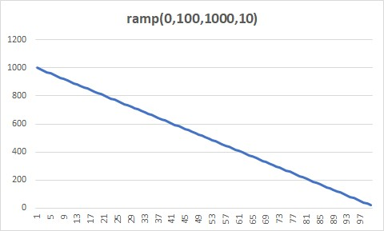

### log($startX,$startY,$scale=1)

It generates log values

> ->gen('when _index<200 then idtable.value=log(0,0,100)')

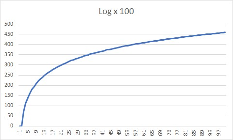

### exp($startX,$startY,$scale=1)

It generates exponential values. The scale is for division of Y

> ->gen('when _index<200 then idtable.value=exp(0,0,10)')

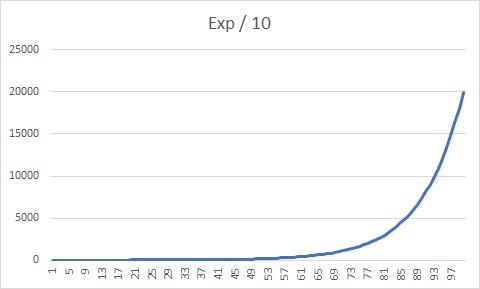


### sin($startX,$startY,$speed=1,$scale=1)

It generates a sinuzoid values. The angle is calculated with the current index x the speed (in degree)  

> ->gen('when _index<200 then idtable.value=sin(0,0,1,1)')

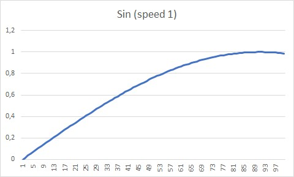

> ->gen('when _index<200 then idtable.value=sin(0,0,10,1)')

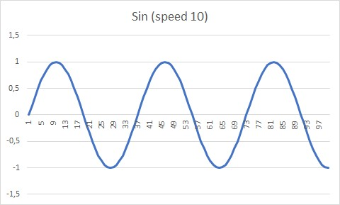

### atan($centerX,$startY,$speed=1,$scale=1)

It generates arc-tangent values

```
->gen('when _index<200 then idtable.value=atan(50,0,20,10)')
```

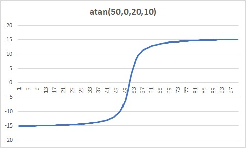

### parabola($centerX,$startY,$scaleA=1,$scaleB=1,$scale=1)

It generates a parabola. It is possible to invert the parabola by changing the scaleA by negative

> ->gen('when _index<200 then idtable.value=parabola(50,0,1,1,1)')

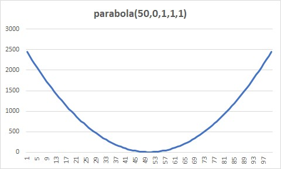

> ->gen('when _index<200 then idtable.value=parabola(50,0,-1,1,1)')

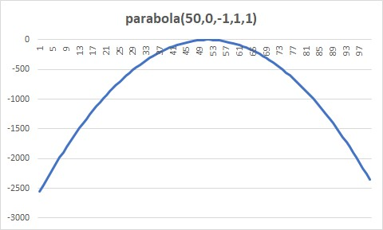

> ->gen('when _index<200 then idtable.value=parabola(50,2500,-1,1,1)')


### bell($centerX, $startY, $sigma=1, $scaleY=1)

It generates a bell values, sigma is the "wide" of the bell.

> ->gen('when _index<=360 then idtable.value=bell(50,0,30,100)')  

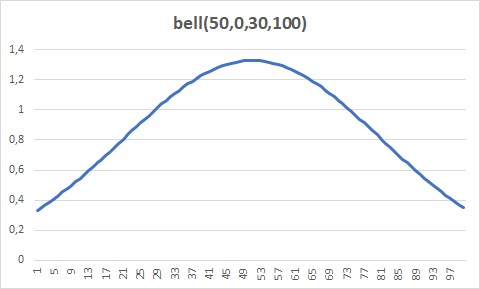

> ->gen('when _index<=360 then idtable.value=bell(50,0,30,100)')  

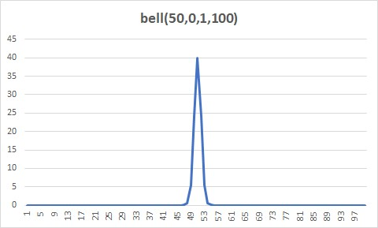

## Fixed functions (numbers)

Functions that generates a single value

### randomprop(...$args)

It generates a random value by using different proportions or probabilities.

> randomprop(1,2,3,30,50,20) 

* there is 30% for 1  
* there is 50% for 2  
* there is 20% for 3  

> ->gen('when _index<200 then idtable.value=randomprop(1,2,3,30,50,20)')
> ->gen('when always then idtable.value=randomprop(idtable,null,1,1)) // there is a 50% chance the value is null


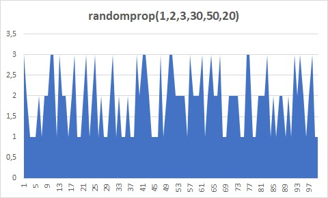

### random($from,$to,$jump=1,$prob0=null,$prob1=null,$prob2=null)

It generates a random value from $from to $to.

```
random(1,10) // 1,2,3,4,5,6,7,8,9,10
random(1,10,2) // 1,3,5,7,9
```

> ->gen('when _index<200 then idtable.value=random(-10,10,0.2)')


Optionally, you could add a probability for each segment. 

> random(0,100,1,10,20,70)

* There is a 10% probability the random value is between 0 and 33
* There is a 20% probability the random value is between 34 and 66
* There is a 70% probabitity the random value is between 67 to 100

> idtable.value=random(0,200,1,80,10,10)

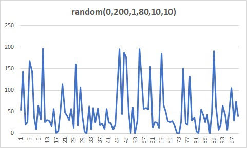

> idtable.value=random(0,200,1,10,80,10)

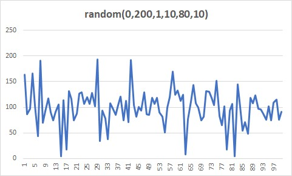

> idtable.value=random(0,200,1,10,10,80)

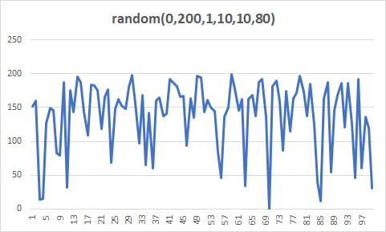


### field.speed=xxxx

It sets the speed of the field. If the field has speed then it's value it's increased for each iteraction.

### field.accel=xxxx

It sets  the acceleration of a field. If the field has acceleration then it's speed it's increased for each iteraction.

### field.value=xxxx

It sets the value of a field

### field.getvalue

It returns the value of a field

### field.valueabs

It transform the value of a field to absolute (always positive)

### field.day , field.month , field.year, field.hour, field.minute, field.weekday

It returns the current part of the date (day,month,year,hour,minute and weekday).  

> It is used for field of the type datetime.
> It is not for set, no matter the value.
> Weekday = 1= monday, 7=sunday


### field.stop=xxxx

It sets or returns the value of a field, it also marks the speed and acceleration to zero.

### field.add=xxxx

It adds a value to a field.  If the field is of the type datetime, then you could add an "hour","minute" and "day"
```
field.add=20 // add 20 to the field
field.add="5h" // adds 5 hours to the field. 5m = 5 minutes, 5d = 5 days
```

### field.concat=xxxx

It concatenates a value to a field. 
```
field.concat=20 
field.concat="abc" 
```


### field.skip=xxx

It skips a value to the next value. It is used for date.

| value        |
|--------------|
| hour         |
| day          |
| month        |
| monday       |
| tuesday      |
| wednesday    |
| thursday     |
| friday       |
| saturday     |
| sunday       |

```
field.skip='day'  // it skips to the next day (it start at 00:00)
field.skip='month'  // it skips to the next month (it start at the first day of the month 00:00)
field.skip='monday' // (or the name of the day), it skips to the next monday (00:00 hours)
field.skip='hour' // it skips to the next hour (minute 00)
```


## Arrays and texts

### ->setArray('arrayname',[])

It sets an array.  If the array is associative, then the value is the probability of selection.

```
->setArray('arrayname',['a','b','c']) // it sets an array with 3 values with the same chances.
```

```
->setArray('arrayname',['a'=>80,'b'=>10,'c'=>10]) // it sets an array with 3 values with the changes of a(80%),b(10%) and c(10%)
```

> Note: arrays and variables share the same space of memory.


### ->setFormat('formatName',[])

It sets a format (template) to merge different arrays.  
The arrays are marked as {{name-of-the-array}}. If the array is not defined then it returns the value of a field.  

If the array is associative then it returns a value according it's probability.

```
->setFormat('maleNameFormats',['{{namearr}} {{lastnamearr}}','Dr.{{namearr}} {{lastnamearr}}'])
```

```
->setFormat('maleNameFormats',['{{namearr}} {{lastnamearr}}'=>80,'Dr.{{namearr}} {{lastnamearr}}'=>20]) //probability of 80% and 20%
```

### randomarray("arrayname",'field'=null)

it returns a random row inside of the array declared with setArray(). If the array is associative then it returns a value according it's probability.

If the array is a list of objects, then it returns the value of the field.

```
->gen('when always set name.value=randomarray("arrayname")')
```
### randomformat($nameFormat)

It generates a random text using a mixes of format and different arrays.

```
->gen('when always set fullname.value=randomformat("nameFormat")')
```


### randomtext($starting,$arrayName,$paragraph,$wordMinimum,$wordMaximum)

It generates a random text by using the array with name $arrayName.  The text could starts with a default text.

If $paragraph is not 0, then it could generates paragraph (line carriage)

If arrayName is empty then it uses an array with "lorem ipsum" words.

```
->gen('when always then text.value=randomtext("Lorem ipsum dolor","loremIpsumArray",1,4,30)')
```

### randommask($mask,$arrayName='')

It generates a text based on a mask

* \# = a (optional) random digit
* 0 = a random digit.
* u = An uppercase letter
* l = A lowercase letter
* v = An upper or lowercase letter.
* w = An random letter (upper or lowercase) or a digit.
* X = An optional letter (uppercase)
* x = An optional letter (lowercase)
* ? = A random word from an array or a format.
* \ = Escape character, (the next character will be returned without processing)

> randommask("##-00 uu ll \0 - oo (a)","lastName") // where lastName is an array

## File features

### arrayFromFolder()

It reads a folder and returns an array of files. The reading is not recursive and it could be filtered by extension.  

> $filesWithoutExtension=$chaos->arrayFromFolder($localfolder,'jpg',false); 

### Script function destionationArray.copyfilefrom()=originArray.getvalue

It copies a file from a location to another. 

```
->gen('when always set ImageDestination.copyfilefrom=ImageSource.getvalue')
```

## Database

This library allows to interact directly with the database, reading and inserting information.

For example, let's say the next exercise:

```php
$db=new PdoOne("mysql","localhost","root","abc.123","chaosdb"); // connect to mysql
$db->open(); // it opens the connection

$chaos = new ChaosMachineOne();
$chaos->debugMode=true;
$chaos->table('SOMETABLE', 1000) // we will work with the table SOMETABLE
    ->setDb($db) // we indicates to our library to use the connection to the database
    ->field('fixedid','int','local',5) // we created a field (local), it will not be stored in the database
    ->field('idcustomer', 'int','identity', 0, 0, 1000) // we created a field (database), however it is identity so it will not be stored in the database
    ->field('name', 'string', 'database', '', 0, 45) // this field will be stored in the database
    //...
    ->setInsert()
    ->run(); // finally we insert the new values (1000 values) : insert into SOMETABLE (name) values(...);
```

### table($table, $conditions,$prefix='origin_')

It sets the working table.

* $table = it is the name of the table
* $conditions (int) = It could indicates the number of rows to generate.
* $conditions (string) = it indicates the table (or query) to use as "origin"
* $prefix (string) = it sets a prefix value.

```php
$chaos->table('SOMETABLE', 1000) // insert 1000 rows into SOMETABLE
$chaos->table('SOMETABLE', 'ORIGINTABLE') // insert "n" rows into SOMETABLE. "n" depends in the number of rows of ORIGINTABLE.
$chaos->table('SOMETABLE', 'select * from ORIGINTABLE') // insert "n" rows into SOMETABLE. "n" depends in the number of rows of ORIGINTABLE.

```

The value of the query is stored in the variables called : origin_**name of the column**

### insert($storeCache=false,$echoProgress=null,$continueOnError=false,$maxRetry=3)

Insert random values into the database.

Note: Deprecated Use instead setInsert()

* $storecache = if true then it inserts a value and it stores its value into memory.
* $echoProgress = (printf format) if it is not empty then it shows the progress (echo)
* $continueOnError = if true then it continues if insert fails.
* $maxRetry = number of retries (if insert fails)

### sertInsert($continueOnError=false,$maxRetry=3)

It sets to insert the values into the database. This operation is executed when the command run() is executed.

* $continueOnError = if true then it continues if insert fails.  
* $maxRetry = number of retries (if insert fails)  

### setArrayFromDBQuery($name,$query,$probability=[1],$queryParam=null)

It sets an array using a query

* $name = name of the array
* $query = source query of the original values. It must returns a single column.
* $probability = array of probability. If [1] it means 100% for each value, [80,20] means 80% for the first half values of the array and 20% for the second half.
* $queryParam = (optional) parameters of the query.


```php
->setArrayFromDBQuery('namemale','select first_name from sakila.actor')
->setArrayFromDBQuery('lastname','select last_name from sakila.actor where actor_id={{fixedid}}',[1])
```

> Note: arrays and variables share the same space of memory.

### setArrayFromDBTable($name,$table,$column,$probability=[1])

It sets an array using a table

* $name = name of the array
* $query = source query of the original values. It must returns a single column.
* $probability = array of probability. If [1] it means 100% for each value, [80,20] means 80% for the first half values of the array and 20% for the second half.
* $queryParam = (optional) parameters of the query.


```php
->setArrayFromDBTable('namemale','sakila.actor','first_name')
->setArrayFromDBTable('lastname','sakila.actor','first_name',[1])
```

> Note: arrays and variables share the same space of memory.

## version
* 1.9 2020-08-12  
    * Updated a problem with the database (forever loop)  
    * Updated code  
    * Updated dependencies.
* 1.8 2020-04-09
    * method insert() is deprecated. Use instead setInsert()
    * new method setInsert()
* 1.7 2020-04-09 Updated Dependency eftec/pdoone (1.19 => 1.28.1)
* 1.6 Added function showTable() and show()
* 1.5 Updated MiniLang 2.12 -> 2.14
* 1.4 We could run ->insert(true)->show() at the same time. Insert(true) will keep the values (so we could show it without recalculating)
* 1.3 Now it could copy files.
   New method arrayFromFolder() reads all files of a folder.  
   Script method field.copyfilefrom=origin copies from from an origin (array of files)    
   And now randommask (?) wildcard works with array and formats.     
* 1.2 Some cleanup.
* 1.1 Now Minilib is a external library   
* 1.0 First open source version   

## License

Dual License

LGPL-V3 and Commercial License.

Copyright Jorge Patricio Castro Castillo (2018)
