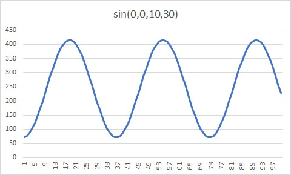
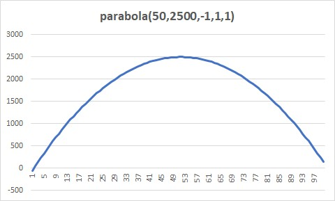

# ChaosMachineOne for PHP
A controlled random generator data for PHP. The objective of the library is to help generate and fill random values to 
memory, Mysql, Sql Server and Oracle while we could add some tendencies/biases so the values are not as fully random.

[](https://travis-ci.org/EFTEC/ChaosMachineOne)
[](https://packagist.org/packages/eftec/chaosmachineone)
[](https://packagist.org/packages/eftec/chaosmachineone)
[]()
[]()
[]()
[]()

# Table of contents

- [ChaosMachineOne for PHP](#chaosmachineone-for-php)
  - [What is the objective?](#what-is-the-objective)
  - [fields](#fields)
  - [gen](#gen)
    - [minilang](#minilang)
    - [Reserved variables](#reserved-variables)
    - [Logic](#logic)
  - [Range Functions (numbers)](#range-functions-numbers)
    - [ramp($fromX, $toX, $fromY, $toY)](#rampfromx-tox-fromy-toy)
    - [log($startX,$startY,$scale=1)](#logstartxstartyscale1)
    - [exp($startX,$startY,$scale=1)](#expstartxstartyscale1)
    - [sin($startX,$startY,$speed=1,$scale=1,$angle=null)](#sinstartxstartyspeed1scale1anglenull)
    - [atan($centerX,$startY,$speed=1,$scale=1)](#atancenterxstartyspeed1scale1)
    - [parabola($centerX,$startY,$scaleA=1,$scaleB=1,$scale=1)](#parabolacenterxstartyscalea1scaleb1scale1)
    - [bell($centerX, $startY, $sigma=1, $scaleY=1)](#bellcenterx-starty-sigma1-scaley1)
  - [Fixed functions (numbers)](#fixed-functions-numbers)
    - [randomprop(...$args)](#randompropargs)
    - [random($from,$to,$jump=1,...$probs)](#randomfromtojump1probs)
    - [field.speed=xxxx](#fieldspeedxxxx)
    - [field.accel=xxxx](#fieldaccelxxxx)
    - [field.value=xxxx](#fieldvaluexxxx)
    - [field.getvalue](#fieldgetvalue)
    - [field.valueabs](#fieldvalueabs)
    - [field.day , field.month , field.year, field.hour, field.minute, field.weekday](#fieldday--fieldmonth--fieldyear-fieldhour-fieldminute-fieldweekday)
    - [field.stop=xxxx](#fieldstopxxxx)
    - [field.add=xxxx](#fieldaddxxxx)
    - [field.concat=xxxx](#fieldconcatxxxx)
    - [field.skip=xxx](#fieldskipxxx)
  - [Arrays and texts](#arrays-and-texts)
    - [->setArray('arrayname',[])](#-setarrayarrayname)
    - [randomarray("arrayname",'field'=null)](#randomarrayarraynamefieldnull)
    - [->setFormat('formatName',[])](#-setformatformatname)
    - [randomformat($nameFormat)](#randomformatnameformat)
    - [randomtext($starting,$arrayName,$paragraph,$wordMinimum,$wordMaximum)](#randomtextstartingarraynameparagraphwordminimumwordmaximum)
    - [randommask($mask,$arrayName='')](#randommaskmaskarrayname)
  - [Other Features](#other-features)
    - [end](#end)
    - [omit](#omit)
  - [File features](#file-features)
    - [arrayFromFolder()](#arrayfromfolder)
    - [Script function destionationArray.copyfilefrom()=originArray.getvalue](#script-function-destionationarraycopyfilefromoriginarraygetvalue)
  - [Database](#database)
    - [table($table, $conditions,$prefix='origin_')](#tabletable-conditionsprefixorigin_)
    - [update($table,$indexcolumn,$indexvalue,$updatecolumn1,$updatevalue1...)](#updatetableindexcolumnindexvalueupdatecolumn1updatevalue1)
    - [insert($storeCache=false,$echoProgress=null,$continueOnError=false,$maxRetry=3)](#insertstorecachefalseechoprogressnullcontinueonerrorfalsemaxretry3)
    - [setInsert($continueOnError=false,$maxRetry=3)](#setinsertcontinueonerrorfalsemaxretry3)
    - [setArrayFromDBQuery($name,$query,$probability=[1],$queryParam=null)](#setarrayfromdbquerynamequeryprobability1queryparamnull)
    - [setArrayFromDBTable($name,$table,$column,$probability=[1])](#setarrayfromdbtablenametablecolumnprobability1)
- [Examples:](#examples)
  - [Connect to Sql Server](#connect-to-sql-server)
  - [Connect to Mysql](#connect-to-mysql)
  - [Generate code based in a table](#generate-code-based-in-a-table)
  - [Insert 1000 random values](#insert-1000-random-values)
  - [Update all rows of a table](#update-all-rows-of-a-table)
  - [version](#version)
  - [License](#license)

## What is the objective?

Sometimes we want to generate fake values for the database that are controlled and  consistent. So, this library tries 
to create an ordered chaos.

While there are libraries to generate random values (such as fzaninotto/Faker), the objective of this library is to fill
tables with random but credible/with a trend value.


[Medium Article](https://medium.com/cook-php/chaos-and-control-or-the-art-of-randomness-40e04662a81e)

Let's say the next exercise.  We want to generate random values for a new system (sales)

If we generate random values, the chart would look like

> ->gen('when _index<200 then idtable.value=random(-10,10,0.2)')


Why is it so random? it is because they are random values (sic).  

So, they are right, but they don't look real because there is not a trend or a natural flow of information, it is just static noise.

Then, let's generate the same value with a sine (for example, let's say that there is a cycle of sales)

> ->gen('when _index<200 then idtable.add=sin(0,0,10,30)')



The chart has a trend, but it is too predictable.  So, let's add all factors.


> ->gen('when _index<200 then idtable.value=random(-10,10,0.2) and idtable.add=sin(0,0,10,30)')


While this chart is far from real, but it is not TOO RANDOM, and it has a trend.

## fields

> field($name,$type,$special='database',$initValue=0,$min=PHP_INT_MIN,$max=PHP_INT_MAX)

fields are our values. They could be numeric, date and string.

* Fields could have speed and acceleration. However, if you change the value manually, then the speed and acceleration is ignored.

* "field.value=X"  it sets the value of the field.
* "field.speed=X"  it sets the speed of the field.
* "field.accel=X"  it sets the acceleration of the field. If the speed is set manually, then the acceleration is ignored.
* "field.stop=X" it sets the speed and acceleration to zero, and sets the value to X.

* The speed and acceleration is evaluated when it is executed (method run() )


Examples:
```
"set field.value=20" // it sets the value of the field to 20   
"set field.speed=3" // it sets the speed of the field by 3. The field increases the value every cycle by 3    
"set field.accel=1" // it sets the acceleration of the field by 1. The field increases the speed every cycle by 1    
"set field.value=30 and field.speed=1" // the value is always 30, no matter the speed
```

```php
$this->gen('when _index<40 then idtable.accel=1'); // the acceleration is 1 until index=40
$this->gen('when _index<60 then idtable.accel=-1'); // the acceleration is -1 until index=60
$this->gen('when _index<100 then idtable.accel=-1'); // the acceleration is -1 until index=100
```


## gen

It generates a value using the Minilang syntaxis.

The syntaxis is as follows:

```
when logic and/or logic2 and/or logic3 then setvalue1 , setvalue2 , setvalue3
```

### minilang

| Variable                                           | Explanation                                         | Example                              |
|----------------------------------------------------|-----------------------------------------------------|--------------------------------------|
| $var                                               | it is php global variable.                          | $var="hi"                            |
| field                                              | it is an minilang variable.                         | field                                |
| field.value   it is the value of a column (if any) | field.value="hi"                                    |                                      |
| _index                                             | indicates the current index (current number of row) | _index<200                           |
| 20 , 20.50                                         | its a fixed value                                   | 20,50.3                              |
| "text",'text'                                      | it is fixed string value                            | "text",'text'                        |
| fn()                                               | its a function                                      | myfunction(value), some.myfunction() |

### Reserved variables

| Reserved word | Explanation                                                                  |
|---------------|------------------------------------------------------------------------------|
| null          | null value                                                                   |
| false         | false value                                                                  |
| true          | true value                                                                   |
| on            | 1                                                                            |
| off           | 0                                                                            |
| undef         | -1 (for undefined)                                                           |
| flip          | (special value). It inverts a value ON<->OFF<br>Used as value.flip           |
| now           | returns the current timestamp (integer)                                      |
| timer         | returns the current timestamp (integer)                                      |
| interval      | returns the interval (in seconds) between the last change and now            |
| fullinterval  | returns the interval (in seconds) between the start of the process and   now |
| _index        | returns the current index (the current counter of row)                       |
| always        | reserved word. It is used as "when always"                                   |

Examples:

myvar = is a variable

> when always set myvar.value=null   
> when _index<20 set myvar.value=false

Limits.
* Parenthesis are now allowed (unless it is defines a function).
* * > a1=(20+30) is not allowed however a1=20 , a1+30 is allowed
* The syntax is divided in two parts, one of the logic (when) and other is the set (then)
* Conditions are evaluated in order. If one condition is meet, then it stop other evaluations.
* * > ```php
    > $this->gen('when a1=1 then b1=1');
    > $this->gen('when a1<10 then b1=10'); // if a1=1 then this expression is not evaluated.
    > ```


### Logic

It sets the condition(s) separated by **"and"** or **"or"**

> It is not allowed to use more than operator for logic.  a1=20+30 is not allowed.


## Range Functions (numbers)

Functions that generates a range of values


### ramp($fromX, $toX, $fromY, $toY)

It generates a ramp values (lineal values)
```
->gen('when _index<200 then idtable.value=ramp(0,100,10,1000)')
```


```
->gen('when _index<200 then idtable.value=ramp(0,100,1000,10)')
```


### log($startX,$startY,$scale=1)

It generates log values

> ->gen('when _index<200 then idtable.value=log(0,0,100)')


### exp($startX,$startY,$scale=1)

It generates exponential values. The scale is for division of Y

> ->gen('when _index<200 then idtable.value=exp(0,0,10)')


### sin($startX,$startY,$speed=1,$scale=1,$angle=null)

It generates a sinusoid values. The angle

* startX is the position of the X
* startY is the position of the Y (you can move up and down the values)
* Speed is the speed of the angle.
  * For example sin(0,0,1,1), every _index value counts as a degree.
  * For example sin(0,0,2,1), every _index value counts as x2 degree.
* scale is the scale (Y) of the chart.
* angle, if it is not set then it is calculated with the current index x the speed (in degree). If not, then it is used to determine the angle of the sine value

```php
$this->gen('when _index<200 then idtable.value=sin(0,0,1,1)'); // speed (horizontal) is 1.
```


```php
$this->gen('when _index<200 then idtable.value=sin(0,0,10,1)'); // speed (horizontal) is 10
```


### atan($centerX,$startY,$speed=1,$scale=1)

It generates arc-tangent values

```php
$this->gen('when _index<200 then idtable.value=atan(50,0,20,10)');
```


### parabola($centerX,$startY,$scaleA=1,$scaleB=1,$scale=1)

It generates a parabola. It is possible to invert the parabola by changing the scaleA by negative

```php
$this->gen('when _index<200 then idtable.value=parabola(50,0,1,1,1)');
```


```php
$this->gen('when _index<200 then idtable.value=parabola(50,0,-1,1,1)');
```


```php
$this->gen('when _index<200 then idtable.value=parabola(50,2500,-1,1,1)');
```




### bell($centerX, $startY, $sigma=1, $scaleY=1)

It generates a bell values, sigma is the "wide" of the bell.

```php
$this->gen('when _index<=360 then idtable.value=bell(50,0,30,100)');
```


```php
$this->gen('when _index<=360 then idtable.value=bell(50,0,1,100)');
```


## Fixed functions (numbers)

Functions that generates a single value

### randomprop(...$args)

It generates a random value by using different proportions or probabilities.

> randomprop(1,2,3,30,50,20)

* there is 30% for 1
* there is 50% for 2
* there is 20% for 3

Example:

```php
$this->gen('when _index<200 then idtable.value=randomprop(1,2,3,30,50,20)'); // 30% chance of 1, 50% chance of 2, 20% change of 3
$this->gen('when always then idtable.value=randomprop(idtable,null,1,1)); // there is a 50% chance the value is keep and 50% chance the value is null
```


### random($from,$to,$jump=1,...$probs)

It generates a random value from $from to $to.

```php
random(1,10) // 1,2,3,4,5,6,7,8,9,10
random(1,10,2) // 1,3,5,7,9
```

```php
$this->gen('when _index<200 then idtable.value=random(-10,10,0.2)');
```


Optionally, you could add a probability for each segment.

> random(0,100,1,10,20,70)

* There is a 10% probability the random value is between 0 and 33
* There is a 20% probability the random value is between 34 and 66
* There is a 70% probability the random value is between 67 and 100

> idtable.value=random(0,200,1,80,10,10)   // values trends to stay at the bottom


> idtable.value=random(0,200,1,10,80,10)  // values trends to stay at the center


> idtable.value=random(0,200,1,10,10,80) // values  trends to stay at the top


You can also use the next name of values

| name      | values equivalents   |
|-----------|----------------------|
| fakebell  | [10, 25, 30, 25, 10] |
| fakebell2 | [15, 22, 26, 22, 15] |
| fakebell3 | [5, 15, 60, 15, 5]   |
| rightbias | [5, 10, 20, 35, 30]  |
| leftbias  | [30, 35, 20, 10, 5]  |
| flat      | [20, 20, 20, 20, 20] |
| up        | [10, 20, 30, 40, 50] |
| down      | [50, 40, 30, 20, 10] |
| sine      | [10, 30, 10, 30, 10] |

Example:

```php
$this->gen('when _index<200 then idtable.value=random(1,100,1,"fakebell")');
```


### field.speed=xxxx

It sets the speed of the field. If the field has speed then it's value it's increased for each interaction.

Example:

```php
$this->gen('when date.weekday<6 set counter.speed=1'); // the speed during the working days is 1
$this->gen('when date.weekday>=6 set counter.speed=2'); // the speed during the weekends is 2
// counter=1 if counter initially is 1, and the variable date changes 1 day per iteraction the:
// monday: counter 2
// thuesday: counter 3
// wednesday: counter 4
// thursday: counter 5
// friday: counter 6
// saturday: counter 8
// sunday: counter 10
// monday: counter 11
```


### field.accel=xxxx

It sets  the acceleration of a field. If the field has acceleration then it's speed it's increased for each iteration.

Example:

```php
$this->gen('when always set counter.acceleration=1'); 
// counter.value: 1 counter.velocity: 0
// counter.value: 2 counter.velocity: 1
// counter.value: 4 counter.velocity: 2
// counter.value: 7 counter.velocity: 3
```


### field.value=xxxx

It sets the value of a field

Example:

```php
$this->gen('when always set var1=1 and var2="hello world" and var3=2+3'); 
```


### field.getvalue

It returns the value of a field

Example:

```php
$this->gen('when always set var1=var2.getvalue'); 
```


### field.valueabs

It transforms the value of a field to absolute (always positive)


Example:

```php
$this->gen('when always set var1=var2.getvalueabs'); 
```


### field.day , field.month , field.year, field.hour, field.minute, field.weekday

It returns the current part of the date (day,month,year,hour,minute and weekday).

> It is used for field of the type datetime.
> It is not for set the value, it is only for get the value, no matter the value.
> Weekday: 1= monday, 7=sunday
>
> Month: 1 = january, 12= december

Example:

```php
$this->gen('when field.day=1 set var1="first day of the month"'); 
```


### field.stop=xxxx

It sets or returns the value of a field, it also marks the speed and acceleration to zero.

### field.add=xxxx

It adds a value to a field.  If the field is of the type datetime, then you could add an "hour","minute" and "day"
```php
$this->gen('when always set field.add=20'); // add 20 to the field
$this->gen('when always set field.add="5h"'); // adds 5 hours to the field. 5m = 5 minutes, 5d = 5 days
```

### field.concat=xxxx

It concatenates a value to a field.
```php
this->gen('when always set field1.value="hello" and field2.value="world"');
this->gen('when always set field1.concat=field2'); // field1: "helloworld"
```


### field.skip=xxx

It skips a value to the next value. It is used for date.

| value        |
|--------------|
| hour         |
| day          |
| month        |
| monday       |
| tuesday      |
| wednesday    |
| thursday     |
| friday       |
| saturday     |
| sunday       |

```
field.skip='day'  // it skips to the next day (it start at 00:00)
field.skip='month'  // it skips to the next month (it start at the first day of the month 00:00)
field.skip='monday' // (or the name of the day), it skips to the next monday (00:00 hours)
field.skip='hour' // it skips to the next hour (minute 00)
```

```php
$this->gen('when field.month=3 set field.skip="month"'); // we skip march.
```


## Arrays and texts

### ->setArray('arrayname',[])

It sets an array.  If the array is associative, then the value is the probability of selection.

```php
$this->setArray('arrayname',['a','b','c']) // it sets an array with 3 values with the same chances.
```

```php
$this->setArray('arrayname',['a'=>80,'b'=>10,'c'=>10]) // it sets an array with 3 values with the changes 
                                                       // of a(80%),b(10%) and c(10%)
```

> Note: arrays and variables share the same space of memory, so if we have a variable and array with the same value, 
then one of them will be overridden.

### randomarray("arrayname",'field'=null)

it returns a random row inside the array declared with setArray(). If the array is associative then it returns a value
according its probability.

If the array is a list of objects, then it returns the value of the field.

```php
$this->gen('when always set name.value=randomarray("arrayname")');
```

Example:

```php
$this->setArray('namearr',['john','bob','peter']);
$this->gen('when always set name.value=randomarray("namearr")'); // example: "john"
```


### ->setFormat('formatName',[])

It sets a format (template) to merge different arrays.

> This function  is used in tandem with **randomformat()**

The arrays are marked as **{{name-of-the-array}}**. If the array is not defined then it returns the value of a field.

If the array is associative then it returns a value according its probability.

```php
$this->setFormat('maleNameFormats',['{{namearr}} {{lastnamearr}}','Dr.{{namearr}} {{lastnamearr}}'])
```

```php
$this->setFormat('maleNameFormats',['{{namearr}} {{lastnamearr}}'=>80,'Dr.{{namearr}} {{lastnamearr}}'=>20]) //probability of 80% and 20%
```

Example:

```php
$this->setArray('namearr',['john','bob','peter']);
$this->setArray('lastnamearr',['doe','smith','johnsons']);
$this->setFormat('maleNameFormats',['{{namearr}} {{lastnamearr}}','Dr.{{namearr}} {{lastnamearr}}']);  // "john doe" or "dr. john doe"
```


### randomformat($nameFormat)

It generates a random text using a mixes of format and different arrays.

```php
$this->gen('when always set fullname.value=randomformat("nameFormat")');
```

Example:

```php
$this->setArray('namearr',['john','bob','peter']);
$this->setArray('lastnamearr',['doe','smith','johnsons']);
$this->setFormat('maleNameFormats',['{{namearr}} {{lastnamearr}}','Dr.{{namearr}} {{lastnamearr}}']);  // "john doe" or "dr. john doe"
$this->gen('when always set fullname.value=randomformat("nameFormat")'); // fullname could be  "john doe", "dr. john doe", "bob doe" or others.
```


### randomtext($starting,$arrayName,$paragraph,$wordMinimum,$wordMaximum)

It generates a random text by using the array with name $arrayName.  The text could start with a default text.

If $paragraph is not 0, then it could generate paragraph (line carriage)

If arrayName is empty then it uses an array with "lorem ipsum" words.

```php
$this->gen('when always then text.value=randomtext("Lorem ipsum dolor","loremIpsumArray",1,4,30)')
```

### randommask($mask,$arrayName='')

It generates a text based on a mask

* \# = a (optional) random digit
* 0 = a random digit.
* u = An uppercase letter
* l = A lowercase letter
* v = An upper or lowercase letter.
* w = An random letter (upper or lowercase) or a digit.
* X = An optional letter (uppercase)
* x = An optional letter (lowercase)
* ? = A random word from an array or a format.
* \ = Escape character, (the next character will be returned without processing)

> randommask("##-00 uu ll \0 - oo (a)","lastName") // where lastName is an array

Example:

```php
$this->gen('when always then text.value=randommask("ulllll####000")');
```

## Other Features

### end

It ends the current run.  It is useful when you want to stop inserting values.

Example:

```php
$this->gen('when counter>100 then end()');
```

### omit

It omits the current loop.  It is useful when you want to skip some values.

Example:

```php
$this->gen('when counter>20 and counter<30 then omit()'); // values where counter are in between 20 and 30, are omited.
```

> See skip to omit dates


## File features

### arrayFromFolder()

It reads a folder and returns an array of files. The reading is not recursive, and it could be filtered by extension.

> $filesWithoutExtension=$chaos->arrayFromFolder($localfolder,'jpg',false);

### Script function destionationArray.copyfilefrom()=originArray.getvalue

It copies a file from a location to another.

```php
$this->gen('when always set ImageDestination.copyfilefrom=ImageSource.getvalue')
```

## Database

This library allows to interact directly with the database, reading and inserting information.

For example, let's say the next exercise:

```php
$db=new PdoOne("mysql","localhost","root","abc.123","chaosdb"); // connect to mysql
$db->open(); // it opens the connection

$chaos = new ChaosMachineOne();
$chaos->debugMode=true;
$chaos->table('SOMETABLE', 1000) // we will work with the table SOMETABLE
    ->setDb($db) // we indicates to our library to use the connection to the database
    ->field('fixedid','int','local',5) // we created a field (local), it will not be stored in the database
    ->field('idcustomer', 'int','identity', 0, 0, 1000) // we created a field (database), however it is identity so it will not be stored in the database
    ->field('name', 'string', 'database', '', 0, 45) // this field will be stored in the database
    //...
    ->setInsert()
    ->run(); // finally we insert the new values (1000 values) : insert into SOMETABLE (name) values(...);
```

### table($table, $conditions,$prefix='origin_')

It sets the working table and the number of values to process.

If you are using a database, then table is used to determine where the values will be inserted.

If you are not using a database, then table is only for reference.

* $table = it is the name of the table
* $conditions (int) = It could indicate the number of rows to generate.
* $conditions (array) = It indicates the values to iterates.
* $conditions (string) = it indicates the table (or query) to use as "origin" of values. You can use 
an inner join of queries but the query must returns unique columns.
* $prefix (string) = it sets a prefix value.

```php
$chaos->table('SOMETABLE', 1000) // insert 1000 rows into SOMETABLE
$chaos->table('SOMETABLE', ['a','b','c'],'letter') // it will iterate between a,b,c, each letter could be obtained in the fields called letter
$chaos->table('SOMETABLE', 'ORIGINTABLE') // insert "n" rows into SOMETABLE. "n" depends in the number of rows of ORIGINTABLE.
$chaos->table('SOMETABLE', 'select * from ORIGINTABLE') // insert "n" rows into SOMETABLE. "n" depends in the number of rows of ORIGINTABLE.

```

The value of the query is stored in the fields called : origin_**name of the column**

```php
$chaos->table('SOMETABLE', 'select col1,col2 from ORIGINTABLE','i_'); 
// it will generate the fields i_col1 and i_col2 with the values of the origin table, that you can read and process.
```

### update($table,$indexcolumn,$indexvalue,$updatecolumn1,$updatevalue1...)

Update a simple row of a table.  You can update up to 3 values.

Example:

```php
$this->update('table1','id',20,'col','hello world')
// update table1 set col='hello world' where id=20
$this->update('table1','id',20,'col','hello','col2','world','col3','hi')
// update table1 set col='hello',col2='world',col3='hi' where id=20    
    
$this->gen('when field.value>10 then update("table1","id",field.value,"col","hello world")'); 
// if field>10 then update table1 set col='hello world' where id=field
```


### insert($storeCache=false,$echoProgress=null,$continueOnError=false,$maxRetry=3)

Insert random values into the database.

> **Note: This method is deprecated. Use instead setInsert()**

* **$storecache** : if true then it inserts a value, and it stores its value into memory.
* **$echoProgress** : (printf format) if it is not empty then it shows the progress (echo)
* $continueOnError = if true then it continues if insert fails.
* $maxRetry = number of retries (if insert fails)

### setInsert($continueOnError=false,$maxRetry=3)

It sets to insert the values into the database. This operation is executed when the command run() is executed.

* $continueOnError = if true then it continues if insert fails.
* $maxRetry = number of retries (if insert fails)

```php
$this->table('SOMETABLE', 1000);
$this->field('name', 'string', 'database', '', 0, 45) // this field will be stored in the database
// here we assign the value to name
$this->setInsert(); // insert into sometable(name) values(... ); we repeat it 1000 times.
$this->run();
```


### setArrayFromDBQuery($name,$query,$probability=[1],$queryParam=null)

It sets an array using a query

* $name = name of the array
* $query = source query of the original values. It must returns a single column.
* $probability = array of probability. If [1] it means 100% for each value, [80,20] means 80% for the first half values of the array and 20% for the second half.
* $queryParam = (optional) parameters of the query.


```php
->setArrayFromDBQuery('namemale','select first_name from sakila.actor')
->setArrayFromDBQuery('lastname','select last_name from sakila.actor where actor_id={{fixedid}}',[1])
```

> Note: arrays and variables share the same space of memory.

### setArrayFromDBTable($name,$table,$column,$probability=[1])

It sets an array using a table

* $name = name of the array
* $query = source query of the original values. It must returns a single column.
* $probability = array of probability. If [1] it means 100% for each value, [80,20] means 80% for the first half values of the array and 20% for the second half.
* $queryParam = (optional) parameters of the query.


```php
$this->setArrayFromDBTable('namemale','sakila.actor','first_name');
$this->setArrayFromDBTable('lastname','sakila.actor','first_name',[1]);
```

> Note: arrays and variables share the same space of memory, so if you use the same name, then you can override one of them.

# Examples:

### Connect to Sql Server

```php
$chaos=new ChaosMachineOne();
$chaos->setDb(new PdoOne('sqlsrv','localhost\sqlexpress','sa','password','testdb'));
$chaos->getDb()->logLevel=3; // for debug purpose
$chaos->getDb()->connect();
```

### Connect to Mysql

```php
$chaos=new ChaosMachineOne();
$chaos->setDb(new PdoOne('mysql','localhost','root','password','testdb'));
$chaos->getDb()->logLevel=3; // for debug purpose
$chaos->getDb()->connect();
```


### Generate code based in a table

Let's say that we have a table in the database called table1.

```php
// $chaos is an instance of ChaosMachineOne and it must be connected to the database.
echo "<pre>";
echo $chaos->generateCode('table1'); // the table to generate the code.
// echo $chaos->generateCode('*'); // you also could generate code of all tables at once.
echo "</pre>";
```

The later code will show the next values:

```php
$chaos->table('table1', 1000)
		->setDb($db)
		->field('id', 'int','identity', 0)
		->field('number', 'int','database')
			->isnullable(true)
		->field('text', 'string','database','',0,50)
			->isnullable(true)
		->gen('when always set number.value=random(1,100,1,10,10)') 
		->gen('when always set text.value=random(0,50)')
		->setInsert(true)
		->showTable(['id','number','text'],true)
		->run(true);
```

So you won't need to start from scratch.

> This generation of code also understands foreign keys.


### Insert 1000 random values

```php
$chaos->table('table1', 1000)
    ->field('id', 'int','identity', 0)
    ->field('number', 'int','database')
    ->isnullable(true)
    ->field('text', 'string','database','',0,50)
    ->isnullable(true)
    ->gen('when always set number.value=random(1,100,1,10,10)') // later you can change the values.
    ->gen('when always set text.value=random(0,50)')
    ->setInsert(true) // if you don't want to insert, then you could remove this line
    ->showTable(['id','number','text'],true) // if you don't want to show the values, then you could remove this line.
    ->run(true);
```

> Note: Part of this code could be generated automatically.

### Update all rows of a table

```php
$chaos->table('table1', 'table1') // the first table is used for insert, since we are not inserting, then this value is not used. The second table is the table where the values will be read.
    ->field('text', 'string','database','',0,50)->isnullable(true)
    ->gen('when always set text.value="hello world"')
    ->gen('when always set update("table1","id",origin_id,"text",text.value)') // here whe update the same table. the prefix "origin_" is added automatically
    //->setInsert(true) we don't want to insert.
    ->showTable(['text'],true)
    ->run(true);
```

## version
* 1.13 2022-09-17
  * Added type hinting for the code.
  * Cleaned the code.
  * Updated requirements. Now, this library requires PHP 7.2 and higher.
  * Updated library dependencies.
* 1.12 2022-01-03
  * added random seed to the constructor. By default, the random seed is generated using the microseconds of the processor.
  * fixed the precision of some operations
  * random now allows any array of values.
* 1.11 2021-12-01
  * added the method end(), omit() and update()
  * updated the method sin(). Now it allows to specify the current angle.
  * fixed some bugs with the process of date.
* 1.10 2021-11-22
  * Some cleanups.
* 1.9 2020-08-12
  * Updated a problem with the database (forever loop)
  * Updated code
  * Updated dependencies.
* 1.8 2020-04-09
  * method insert() is deprecated. Use instead setInsert()
  * new method setInsert()
* 1.7 2020-04-09 Updated Dependency eftec/pdoone (1.19 => 1.28.1)
* 1.6 Added function showTable() and show()
* 1.5 Updated MiniLang 2.12 -> 2.14
* 1.4 We could run ->insert(true)->show() at the same time. Insert(true) will keep the values (so we could show it without recalculating)
* 1.3 Now it could copy files.
  New method arrayFromFolder() reads all files of a folder.  
  Script method field.copyfilefrom=origin copies from an origin (array of files)    
  And now randommask (?) wildcard works with array and formats.
* 1.2 Some cleanup.
* 1.1 Now Minilib is an external library
* 1.0 First open source version

## License

Dual License

LGPL-V3 and Commercial License.

Copyright Jorge Patricio Castro Castillo (2018)
